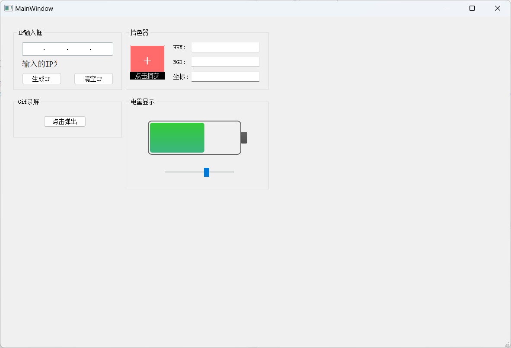

# QtDemo

**环境**：Clion、Cmake、MinGW

绘制一些自定义控件以及小案例

## IP输入框

**涉及**：事件过滤器、QSS、正则

## 拾色器

**涉及**：QGridLayout、QVBoxLayout、QHBoxLayout、QScreen、QMouseEvent、QImage、QTimer、QLineEdit

## Gif录屏

## 电量显示

涉及：QPainter、QLinearGradient、QTimer

## 垂直滚动的文本

涉及：QPropertyAnimation、QResizeEvent

## 水波进度球

涉及：QPainter、QPainterPath、QMouseEvent(press、release、move)

## 跑马灯

涉及：QTextDocument、QStyleOption、QPainter、paintEvent、QStringLiteral

## 按钮切换组

涉及：QPalette、QMouseEvent（Press、Move、enter、leave）、QPainter

## 菜单切换组

涉及：QPalette、QVector、QMouseEvent、QSvgRenderer、QPixmap

## 特效

涉及：QGraphicsBlurEffect、QGraphicsColorizeEffect、QGraphicsDropShadowEffect

## 页面切换器

新涉及：QFontMetrics

## 可拖动的表格

（拖动时携带行数据的透明阴影，gif图片颜色未能显示出来）

新涉及：QTableView、QStandardItemModel、QItemSelectionModel、QDrag、QMimeData、QModelIndex、QDragEnterEvent（enter、move、drop）

## 手写画板

鼠标左键单击绘画，右键单击清空，左键双击保存为图片
